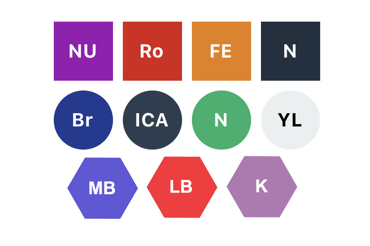

# React Native Text Avatar
Text avatar for the given string like gmail


### Installation

```
npm install react-native-text-avatar --save
or
yarn add react-native-text-avatar
```

### Example Usage

```js
<TextAvatar
 backgroundColor={'#ffff00'}
 textColor={'#0000ff'}
 size={60}
 type={'circle'} // optional
>John Doe</TextAvatar>
```
### Configuration
| Property      | Type          | Default          | Description         | Example    | 
|:-:|:-:|:-:|:-:|:-:|
| backgroundColor | string | '#333' | Container Background Color |  '#ccc' | 
| textColor | string | '#fff' | Text Color |  '#000' | 
| size | number | 60 | Avatar Size |  100 |
| type | string | none | Type of Avatar  Optional values are: circle, hexagon |  'circle' |
